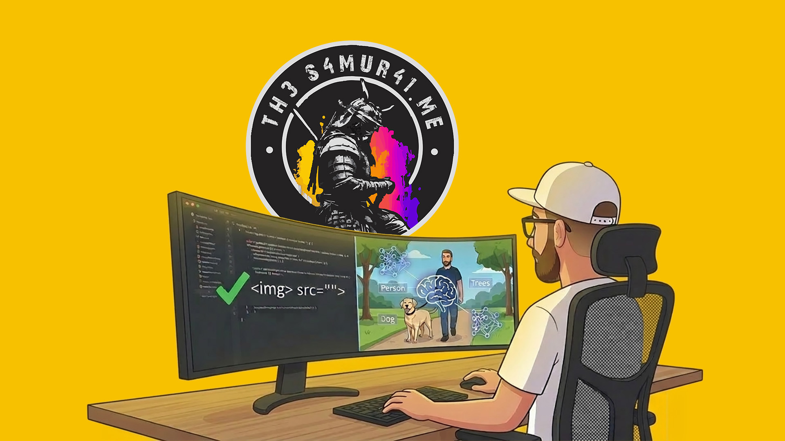
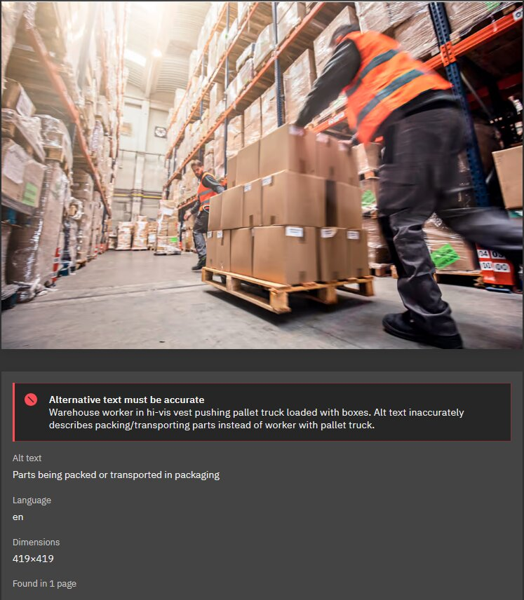

# When AI helps with better detection in accessibility testing

  

AI is everywhere right now, and it was only a matter of time before it made its way into accessibility testing.

Most tools that started integrating AI have done so as an assistant for semi-automated testing or remediation. They help teams fix findings faster, which is valuable. GitHub's work in this area is a good example: [Continuous AI for accessibility: How GitHub transforms feedback into inclusion](https://github.blog/ai-and-ml/github-copilot/continuous-ai-for-accessibility-how-github-transforms-feedback-into-inclusion/).

[Accessibility Cloud](https://www.accessibilitycloud.com/) is the first tool I know of, and tested myself, that integrates AI directly into the detection phase through [Accessibility Cloud AI (ACAI)](https://www.accessibilitycloud.com/acai/).

While the remediation-focused approaches are useful, detection is where things can become a real game changer. Historically, test automation has only covered around 20-30% of accessibility issues. If AI can increase that share during development, teams can identify and resolve more issues much earlier in the process.

Traditional scanners are still strong at rule-based checks, and ACAI builds on that model. But with AI added to detection, it can evaluate issues that require context beyond static rules alone.

## Where AI makes a real difference

A classic example is image alt text.

Most automated scanners can verify whether an image has an `alt` attribute. They can tell you if the attribute is missing or empty. What they usually cannot do is assess whether the provided text actually describes the image meaningfully.

<figure>
  
  <figcaption>AI in Action: Accessibility Cloud identifies that the existing alt text describes "parts being packed," whereas the AI recognizes the actual context of a "worker with a pallet truck," triggering a remediation alert.</figcaption>
</figure>

ACAI can analyze the image and compare that analysis with the current alt text. In practice, I was surprised by how well this worked. It helped identify descriptions that were technically present but still weak, vague, or misleading.

## Not perfect yet, but already useful

The tool is not perfect, and we did encounter a few false positives. Interestingly, those were rarely about the suggested alt text itself. They were more often about interpretation edge cases, such as:

- Not recognizing specific brand names
- Missing context for how an image is used
- Misjudging what details are relevant in a specific UI context

Even with those limitations, it has been a strong addition to our accessibility workflow. We identified and improved a significant number of alt texts that genuinely needed attention.

## Potential future capabilities

Alt text is just the beginning. There are more areas where AI could meaningfully improve what automated accessibility testing can detect.

For instance, AI could bring even more value in document structure analysis.

Because AI models are strong at understanding content hierarchy, they could support fully automated checks for heading quality, such as whether headings are used consistently and whether heading levels are skipped. That could strengthen checks related to [WCAG 2.2 Success Criterion 1.3.1: Info and Relationships](https://www.w3.org/WAI/WCAG22/Understanding/info-and-relationships.html) and [WCAG 2.2 Success Criterion 2.4.6: Headings and Labels](https://www.w3.org/WAI/WCAG22/Understanding/headings-and-labels.html).

Another potential improvement is contrast analysis in complex backgrounds.

Current tools stop working when text sits on gradients, photos, or other non-uniform backgrounds. AI could help estimate contrast more realistically in those scenarios and strengthen checks for [WCAG 2.2 Success Criterion 1.4.3: Contrast (Minimum)](https://www.w3.org/WAI/WCAG22/Understanding/contrast-minimum.html) and [WCAG 2.2 Success Criterion 1.4.11: Non-text Contrast](https://www.w3.org/WAI/WCAG22/Understanding/non-text-contrast.html).

That said, this kind of analysis may still be spotty in some cases, because the result can vary with viewport size, responsive layout changes, and how the image or gradient is cropped on different screens.

## Conclusion

AI in accessibility testing should not replace rule-based checks or human judgment. And even with AI, automated testing will never fully replace manual testing. There are aspects of the user experience that simply cannot be evaluated without a human. But when used to add contextual analysis during detection, AI can close important gaps in traditional automation and improve the quality of what teams catch early.

