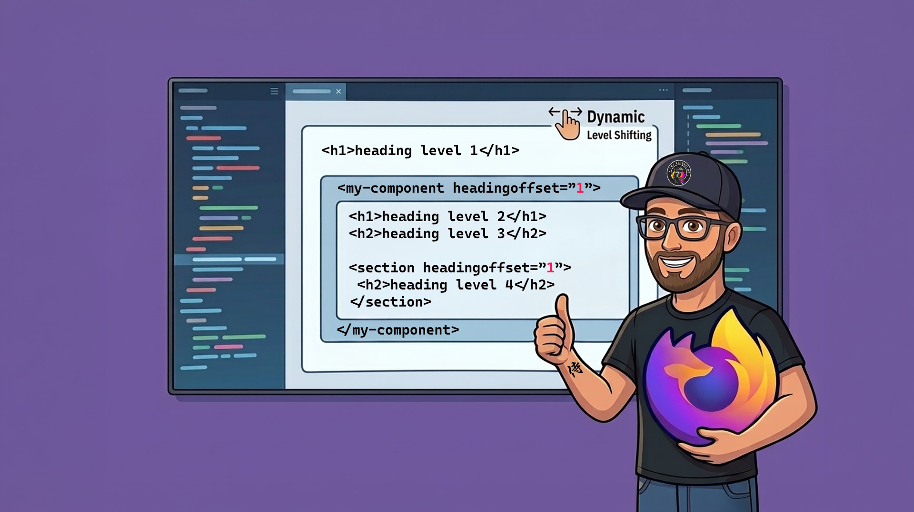

import CodePen from '/src/components/CodePen.astro';

# headingoffset Is Coming: How to Prepare Today



Jake Archibald recently announced that [Firefox implemented `headingoffset` in Firefox Nightly](https://bsky.app/profile/webdevs.firefox.com/post/3mncp42h7ik2b).

This is big news for anyone building reusable UI components with semantic headings. For a long time, developers had to choose between awkward workarounds:

- Ask consumers to provide heading elements via slots.
- Build custom heading-level logic into each component.
- Duplicate components just to avoid broken heading structure.

Now that browser implementation has started, we can finally prepare for a cleaner pattern.

## Why this matters

Reusable components often need to appear in different contexts:

- A card title might be an `h2` on one page.
- The same card title might need to be an `h3` inside a nested section.

Without contextual heading adjustment, one reusable component can easily create skipped or flattened heading levels. That hurts document structure for everyone, especially screen reader users.

`headingoffset` gives us a semantic way to keep component internals stable while adapting heading levels to surrounding context.

## What we do today (and why it is painful)

### Workaround 1: Slot-based heading ownership

We let consumers provide headings from outside the component:

```html
<article-card>
  <h2 slot="title">Billing Settings</h2>
</article-card>
```

This can work, but it shifts structure responsibilities to every caller, which leads to inconsistency.

### Workaround 2: Custom heading-level APIs

We pass a level and render dynamic heading tags:

```html
<article-card heading-level="3"></article-card>
```

Inside the component:

```js
const level = Number(this.getAttribute("heading-level") || 2);
const tag = `h${Math.min(6, Math.max(1, level))}`;
```

This is repetitive, easy to misuse, and often re-implemented differently across codebases.

## What changes with headingoffset

With `headingoffset`, a component can keep meaningful internal heading markup, while parent context controls the effective level.

```html
<h1>Heading level-1</h1>
  <article-card headingoffset="1">
    <h1>Heading level-2</h1>
  </article-card>
```

If `article-card` contains an `h1`, it can be treated as a deeper-level heading in that context.

That means we can write components with clearer semantics, similar to the second workaround but without the need for custom heading-level logic.

## Can we use it today?

Not in stable browsers yet, but we can prepare now.

The [headingoffset polyfill](https://github.com/smockle/headingoffset-polyfill) helps bridge the gap. It checks support and, where needed, applies `aria-level` to mimic `headingoffset` behavior.

```html
<script src="https://unpkg.com/headingoffset-polyfill"></script>
```

This makes progressive enhancement possible:

- Native behavior when supported.
- Polyfilled fallback elsewhere.

> [!NOTE]
> **Firefox + Narrator currently has an announcement quirk**
>
> For cases like `<h1 aria-level="2">`, Firefox with Narrator may announce:
>
> - "heading level 1"
> - then the title
> - then "at level 2"
>
> The same content is announced as expected with Firefox + NVDA/JAWS and with Edge/Chrome + Narrator. At this point, this looks like a Firefox-Narrator interpretation issue rather than a general `aria-level` model problem.

## CSS styling requirements (deeper dive)

As soon as heading levels no longer match the literal element name, targeting styles with `h1` to `h6` selectors is no longer a viable long-term strategy.

That is exactly where the new [`:heading()`](https://developer.mozilla.org/en-US/docs/Web/CSS/Reference/Selectors/:heading_function) selector comes in: it lets you style by effective heading level instead of raw tag name.

Unfortunately, support is not there yet either, so we still need a fallback strategy today.

<baseline-status featureId="heading-selectors"></baseline-status>

```css
:heading(1) {
  /* heading level 1 styles */
}

:heading(2) {
  /* heading level 2 styles */
}

/* Fallback when headingoffset and :heading() are not supported */
@supports not selector(:heading(1)) {
  /* Specific heading without aria-level set, 
     or any heading with aria-level set to the target value. 
   */
  h1:where(:not([aria-level])),
  :is(h1, h2, h3, h4, h5, h6):where([aria-level="1"]) {
    /* heading level 1 styles */
  }

  h2:where(:not([aria-level])),
  :is(h1, h2, h3, h4, h5, h6):where([aria-level="2"]) {
    /* heading level 2 styles */
  }
}
```

This could also be done as progressive enhancement and that may be a better fit if you still support very old browsers. I personally prefer the structure above because once `:heading()` support is good enough, I can delete the `@supports` block and keep the rest unchanged.

Check it out live in the CodePen

<CodePen
  title="headingoffset"
  href="https://codepen.io/editor/th3s4mur41/pen/019e8da3-90df-7090-ae14-3e4541413757"
  defaultTab="result"
  description="A demo of headingoffset with the polyfill and CSS fallback for heading styles."
/>

> [!IMPORTANT]
> If browsers ship `headingoffset` before `:heading()` support, this fallback can break. You can already observe that scenario in Chrome Canary and Edge Canary where `headingoffset` works, but `:heading()` is still unsupported.

## Practical preparation checklist

You can start preparing now, but this should stay out of production for the moment: the fallback proposal is mostly working, yet there is still release risk because browsers may ship `headingoffset` and `:heading()` at different times.

1. Audit components that currently accept `heading-level` props.
2. Identify places where slot-owned headings are used only for hierarchy control.
3. Add exploratory examples behind feature flags or internal demos.
4. Add the polyfill in non-supporting browsers and test with real assistive tech combinations.
5. Keep fallback CSS explicit for `aria-level` mappings where needed.

## Final thought

This is an exciting transition period: we are moving from custom component logic and one-off heading APIs toward a shared, standards-based model for contextual heading structure.

That shift can reduce complexity across many contexts, for example in design systems and CMS implementations, improve long-term maintainability, and keep accessibility behavior more consistent across projects.

What do you think? When will you start replacing your custom heading-level logic with a standards-first approach?
