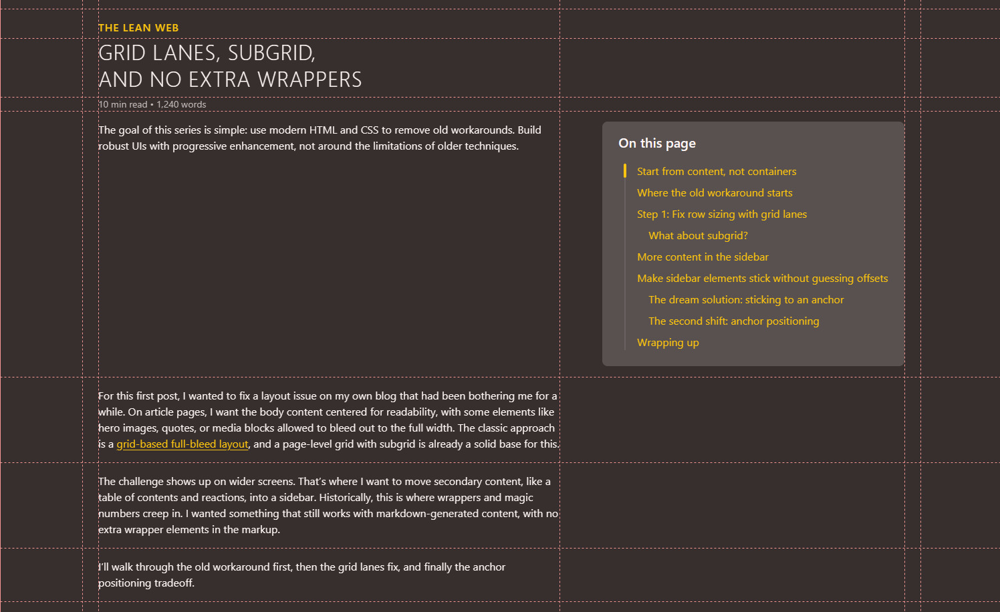

---
title: 'Grid Lanes, Subgrid, and No Extra Wrappers'
date: 2026-05-07T00:00:00Z
image: '../michael-slashing-the-JS-logo-with-katana.jpg'
imageAlt: 'Comic-style illustration of Michaël Vanderheyden slashing the JavaScript logo with a katana'
description: >-
  A narrative walkthrough of how grid lanes, subgrid, and anchor positioning let
  me remove wrapper-heavy CSS workarounds as a progressive enhancement.
tags:
  - HTML
  - CSS
  - WebDev
keywords:
  - semantic HTML
  - progressive enhancement
  - web standards
  - CSS
  - CSS Grid
  - grid lanes
  - subgrid
  - masonry layout
  - anchor positioning
syndication:
  - https://bsky.app/profile/th3s4mur41.me/post/3mlb4qie7ob2p
  - https://www.linkedin.com/posts/michaelvanderheyden_theleanweb-webdev-css-share-7458117276265861120-EcpM

import CodePen from '/src/components/CodePen.astro';

# Grid Lanes, Subgrid, and No Extra Wrappers


The goal of this series is simple: use modern HTML and CSS to remove old workarounds. Build robust UIs with progressive enhancement, not around the limitations of older techniques.

For this first post, I wanted to fix a layout issue on my own blog that had been bothering me for a while.
On article pages, I want the body content centered for readability, with some elements like hero images, quotes, or media blocks allowed to bleed out to the full width. The classic approach is a [grid-based full-bleed layout](https://www.joshwcomeau.com/css/full-bleed/), and a page-level grid with subgrid is already a solid base for this.

The challenge shows up on wider screens. That's where I want to move secondary content, like a table of contents and reactions, into a sidebar. Historically, this is where wrappers and magic numbers creep in.
I wanted something that still works with markdown-generated content, with no extra wrapper elements in the markup.

I'll walk through the old workaround first, then the grid lanes fix, and finally the anchor positioning tradeoff.

> [!NOTE]
> While `grid-lanes` is the technical name of the feature, it was long discussed and documented and might be better known as [Masonry layout](https://developer.mozilla.org/en-US/docs/Web/CSS/Guides/Grid_layout/Masonry_layout).


## Start from content, not containers

The article body is generated from markdown, so the structure is naturally linear: headings, paragraphs, media, and a footer.

I use a rehype plugin to generate and inject a table of contents after the h1.
Reactions are added by Astro logic at build time in the footer. No wrapper around "main content" and "sidebar" blocks.

```html
<body>
 ...
 <main>
  <article>
      <h1>...</h1>
      <nav class="table-of-contents">...</nav>
      <p>...</p>
      <p>...</p>
      <footer>
        <div class="reactions">...</div>
      </footer>
    </article>
  </main>
  ...
</body>
```

That is ideal for Lean Web: semantic HTML first, then layout as enhancement.
This is also how this very page is built.

## Where the old workaround starts

On larger screens, side space is often underused, so moving the table of contents to the sidebar was a natural next step.

Moving across columns is easy. Rows are where things get awkward.
In a grid, the table of contents shares the first row with the h1 or first paragraph. That row then grows to match the table of contents height, which is usually much taller than a single heading.
As a result, the heading (or first paragraph) ends up with a lot of empty space below it.

<figure>
  
  <figcaption>Because the table of contents and the first paragraph share the same grid row, the row height is determined by the taller element. This results in unintended trailing white space beneath the first paragraph, breaking the visual flow of the article content.</figcaption>
</figure>

The table of contents height depends on content, so hard-coding row spans is guesswork.
The classic workaround is a "magic number" row span: big enough for most cases, but still just a guess.

```css
article {
  --inline-margin: 0.5rem;
  --content-width: 70ch;
  --sidebar-width: 30ch;
  --gap: 2rem;
  display: grid;
  grid-template-columns:
    [fullwidth-start] minmax(var(--inline-margin), 1fr)
    [content-start] min(var(--content-width), calc(100% - var(--inline-margin) * 2 - var(--sidebar-width) - var(--gap)))
    [content-end] var(--gap)
    [sidebar-start] var(--sidebar-width)
    [sidebar-end] minmax(var(--inline-margin), 1fr)
    [fullwidth-end];

  & > * {
    grid-column: content;
  }
}
nav.table-of-contents {
  grid-column: sidebar;
  grid-row: 1 / span 10; /* magic number */
}
```

It works — but only to some extent. And I really don't like magic numbers.

## Step 1: Fix row sizing with grid lanes

<baseline-status featureId="grid-lanes"></baseline-status>

Grid lanes let you define named lanes where items size independently from each other. Elements in one lane do not affect the height of elements in another.

```css
article {
  display: grid-lanes;
  grid-template-columns:
    [fullwidth-start] minmax(var(--inline-margin), 1fr)
    [content-start] min(var(--content-width), calc(100% - var(--inline-margin) * 2 - var(--sidebar-width) - var(--gap)))
    [content-end] var(--gap)
    [sidebar-start] var(--sidebar-width)
    [sidebar-end] minmax(var(--inline-margin), 1fr)
    [fullwidth-end];
  @supports not (display: grid-lanes) {
    display: grid;
  }
}
nav.table-of-contents {
  grid-column: sidebar;
  @supports not (display: grid-lanes) {
    grid-row: 1 / span 10; /* magic number */
  }
}
```

In practice, I define a content lane and a sidebar lane, then place the table of contents in the sidebar lane.
Now each element takes only the space it needs, and the row-span workaround is gone.
That works great when the columns are defined on the article itself — but what if, like on this page, the grid is defined on a parent element?

### What about subgrid?

At first glance, it feels like moving to lanes might break [subgrid](https://developer.mozilla.org/en-US/docs/Web/CSS/Guides/Grid_layout/Subgrid).
But only the lane axis behaves differently — the other axis still works like a regular grid, so subgrid remains fully usable.

```css
main {
  display: grid;
  grid-template-columns:
    [fullwidth-start] minmax(var(--inline-margin), 1fr)
    [content-start] min(var(--content-width), calc(100% - var(--inline-margin) * 2 - var(--sidebar-width) - var(--gap)))
    [content-end] var(--gap)
    [sidebar-start] var(--sidebar-width)
    [sidebar-end] minmax(var(--inline-margin), 1fr)
    [fullwidth-end];
}
article {
  display: grid-lanes;
  grid-template-columns: subgrid;
  @supports not (display: grid-lanes) {
    display: grid;
  }
}
nav.table-of-contents {
  grid-column: sidebar;
  @supports not (display: grid-lanes) {
    grid-row: 1 / span 10; /* magic number */
  }
}
```

> [!WARNING]
> At the time of writing, Chrome supports grid lanes behind experimental flags, but the combination with subgrid is not fully there yet.
> Treat this as progressive enhancement: the layout should still work without it, just without the sidebar.

## More content in the sidebar

Now that the table of contents uses only the height it needs, we can think about moving more things to the sidebar.
On this page, the natural next item would be the article footer with the reactions.

With `grid-lanes`, moving the footer to the sidebar is straightforward, and it is placed right below the table of contents.

## Make sidebar elements stick without guessing offsets

I usually keep the table of contents sticky so readers can navigate while scrolling.
That part is straightforward and doesn't change with `grid-lanes`.

The trickier part now is the footer below it. I do not know the table of contents' height ahead of time, so a fixed top offset is just another magic number waiting to fail.

### The dream solution: sticking to an anchor

The ideal solution would be to make the footer sticky, but instead of a fixed `inset-block-start` (or `top`) value, use the table of contents as the reference point.
Something like this:

```css
nav.table-of-contents {
  anchor-name: --toc;
}
footer {
  grid-column: sidebar;
  position: sticky;
  inset-block-start: anchor(--toc end);
}
```

Unfortunately, combining `position: sticky` with [anchor positioning](https://developer.mozilla.org/en-US/docs/Web/CSS/Guides/Anchor_positioning) is not currently possible.

### The second shift: anchor positioning

<baseline-status featureId="anchor-positioning"></baseline-status>

So instead, I can use anchor positioning to place the footer right below the table of contents.
Note that this solves placement, not sticky behavior. The footer will not scroll with the user — it is anchored to a position, not the viewport.

This works well for the common case, but there is still a caveat.
If the sidebar content grows taller than the viewport, the anchored element can get pushed down and overflow past the page footer — or worse, out of the viewport entirely.
In that case, we have to fall back to a magic number and add the estimated height of the footer as a `margin-block-end` on the table of contents.

```css
nav.table-of-contents {
  anchor-name: --toc;
  margin-block-end: 15rem; /* fallback: estimated height of the footer */
}
footer {
  position: absolute;
  inset-block-start: anchor(--toc end);
}
```

Check out the CodePen below for a demo of this pattern, and feel free to fork it and experiment with it yourself.
<CodePen
  title="grid-lanes and subgrid"
  href="https://codepen.io/editor/th3s4mur41/pen/019db588-5eee-7500-bb0b-f33009caac30"
  defaultTab="result"
  description="Interactive CodePen demo of a wrapper-free article layout using grid lanes, subgrid, and anchor positioning."
/>

## Wrapping up

This pattern is not a silver bullet, and wrappers are still sometimes the pragmatic choice.

But it captures a Lean Web principle I care about: when the platform grows, we should remove complexity, not just move it around.

Here, that means:

- keeping markdown-native HTML structure
- avoiding wrapper-only layout elements
- removing row-span and offset magic numbers
- shipping it as progressive enhancement while browser support matures

Start with semantic HTML and a simple flow layout, then layer these features where support and value align. That is the progressive enhancement approach this whole series is built on.

If you are experimenting with similar patterns, I would love to hear what worked, what broke, and what fallback strategy you picked.
