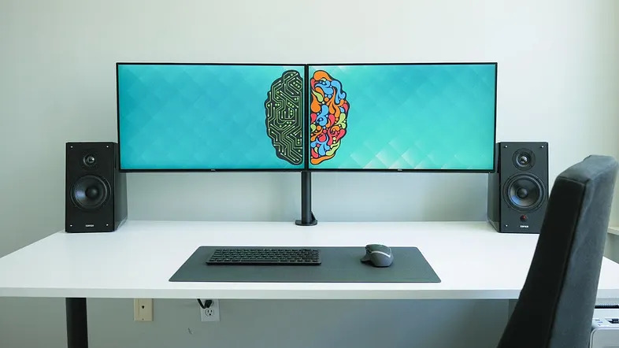

# Things You Need To Test Your Web App

Recently I came across some bugs in an app I developed that only affected iPhone users...

When encountering a bug, the first step is usually to try to reproduce the issue and then to analyze it with developer tools. iOS however, is the most difficult environment to debug/analyze unless you’re fully committed to Apple and are the proud owner of both an iPhone and a Mac. If you are missing any of those, you get no developer tools to debug. But let’s get back to that a bit later.

## The development environment

Developing on fast machines with (multiple) big screens and fast (wired) network is always pretty convenient and what most developer probably prefer when giving the choice.

It allows for quick “compilation” and almost instant deployment of your code and multiple screen make it possible to compare the output in different browser with developer tools opened in each of them.

<figure>

<figcaption>A dual‑monitor setup that mirrors the mix of logic and creativity needed for thorough web app testing.</figcaption>
</figure>

So, it’s not just convenient, it can also heavily increase productivity!

This kind of setup rarely matches what people will use to access your website (or web app) though. So as developer, we need to be able to simulate even extreme end user environment to verify that websites are behaving as we expect them too. Fortunately, there are a bunch of tools that can help us in that matter…

## Network

Speed has a big impact on user experience and while the overall speed of a website can easily be verified with tools like [lighthouse](https://developers.google.com/web/tools/lighthouse/) or [webhint](https://webhint.io/), those don’t really give a concrete idea of the user experience on a slow network like GPRS or even worse, an unstable network.

In order to check the behavior of your website in those environments or even to understand the pain points of certain users. We need to be able to use your own website with similar network limitations. That is when throttling in DevTools come in handy.

<figure>

<figcaption>Network throttling tools in Chrome/Edge (Top) and Firefox (Bottom) help you test how your web app behaves under real‑world connection speeds.</figcaption>
</figure>

[Chromium](https://www.chromium.org/Home) based browsers (Chrome, Edge, Opera, …) also have an option to simulate “Offline” in the same menu. A similar option is also available in Firefox, although in a quite different place (Menu > More > Work Offline).

<figure>

<figcaption>Firefox’s ‘Work Offline’ mode lets you test how your app behaves without an active connection.</figcaption>
</figure>

Currently, the Firefox implementation has one advantage over Chromium: As soon as “work offline” is activated, all connections including WebSocket are terminated.

In Chromium based browsers, while regular requests are also rejected, WebSocket are kept open. That means that it is currently not possible to simulate losing network connectivity using this tool. On the upside, [@MsEdgeDev](https://twitter.com/MSEdgeDev) is currently investigating the possibility to change this.

## Screens

Responsive design is a very prominent topic nowadays, making testing with different screen/browser size the most common of the environment simulation.

The usual test everybody probably does multiple times a day consists of simply resizing the browser to do a basic verification. Developer tools however go a bit further and make it possible to check the exact resolution of specific devices with a simple click.

<figure>

<figcaption>Edge’s device simulation helps you preview and debug your layout across different screen sizes.</figcaption>
</figure>

<figure>

<figcaption>Testing responsive behavior in Firefox with a simulated mobile viewport and live HTML/CSS inspection.</figcaption>
</figure>

You might notice when looking at the 2 screenshots above, that in both browsers, the simulator view also has a direct access to the same virtual network settings we used from the developer tools before.

While this tool is great to help check the website in the exact resolution of specific devices, explicitly naming devices in both simulator view might be a bit misleading though because those don’t take the devices browser engine into account.

## Devices

So how can we check different engines?

Well the easiest ones to test are of course the “desktop” engines of portable browsers like Chromium and Firefox that are available on many platforms (Windows, MacOS, Linux).

It gets more difficult to test with browsers like Safari (WebKit) that are only available on a single platform (in this case MacOS).

Mobile browsers are also somewhat more difficult. While several mobile browsers rely on the same engine as their desktop counterpart. There are still some differences, some of which are even added to the browsers on purpose to improve performance and save battery.

Buying several devices just for this is usually not an option. It would be too expensive, even more so if you’re working with a remote team where everybody would need access to those devices.

There are nowadays however solution to this problem, where we can access a huge list of real devices through what I would call a cloud abstraction.

Services like [lambdatest](http://www.lambdatest.com) and [browserstack](http://www.browserstack.com) let us run our app on a multitude of devices and engines with access to developer tools. we can even use those services in CI for test automation if we want too.

## Conclusion

There are a whole bunch of tools out there to help us make sure most user will get a good or, in the worst case, at least decent experience using our website.

Now this was all about simulation and testing. Before all that, it’s always a good idea to setup a [browserslist](https://github.com/browserslist/browserslist) and combine it with a bunch of linters and pre-compilers to make sure the code we write is already adapted as much as possible to the browsers we want to support in the first place.
