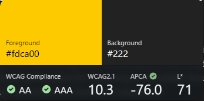

import { Image } from 'astro:assets';
import CodePen from '../../../../components/CodePen.astro';

# Contrast: Beyond WCAG Compliance

Contrast is one of the easiest accessibility aspects to evaluate because it can be measured with algorithms. Whether through automated tools or semi‑automatic checks, developers can quickly verify if text and background combinations meet established standards. This makes contrast a practical starting point for improving accessibility - though, as we'll see, compliance alone doesn't always guarantee the best user experience.

## WCAG vs APCA: Understanding the Difference

While [WCAG guidelines](https://www.w3.org/TR/WCAG22/#contrast-minimum) provide a solid foundation for color contrast, strict compliance sometimes leads to suboptimal results with certain colors.
Consider using the [APCA (Accessible Perceptual Contrast Algorithm)](https://git.apcacontrast.com/documentation/APCAeasyIntro) as an alternative or in addition to WCAG checks. APCA offers a more nuanced approach to contrast that better reflects human perception.

<figure>
	
	<figcaption>
		Visual clarity vs legacy metrics: Though WCAG favors black text on orange background, users often find white more
		readable. APCA captures this perceptual nuance, challenging traditional contrast assumptions.
	</figcaption>
</figure>

Try the demo interactively:

<CodePen
	title="Contrast: WCAG vs APCA"
	href="https://codepen.io/th3s4mur41/pen/KwzRMyJ"
	height={500}
	description="Interactive CodePen demo comparing contrast outcomes for WCAG vs APCA."
/>

<section class="sidenote">

### WCAG Levels in Brief

<dl>
	<dt>A</dt>
	<dd>Minimum accessibility requirements - no contrast requirements</dd>
	<dt>AA</dt>
	<dd>Stronger requirements, widely adopted as the standard baseline - minimum contrast requirements</dd>
	<dt>AAA</dt>
	<dd>Highest level, often impractical for all content - enhanced contrast requirements</dd>
</dl>

</section>

### Real-world example: Stack Overflow

For example, Stack Overflow recently transitioned to APCA for their accessibility design, improving readability and user experience. You can read more about their approach and lessons learned in their blog post: [Accessibility by Design at Stack Overflow](https://stackoverflow.blog/2024/08/07/accessibility-by-design-building-interfaces-for-everyone-at-stack-overflow/).

To keep contrast checks in their automated accessibility testing, they also built custom Axe rules that validate APCA contrast levels (instead of the traditional WCAG contrast ratio checks). That work is available publicly as [StackExchange/apca-check](https://github.com/StackExchange/apca-check/tree/main).

## How to check contrast (DevTools + quick tools)

Even if you run automated checks, it’s useful to spot‑check contrast right in the browser while you build.

### Chrome / Chromium-based browsers

You can see contrast information in a few places:

- Use the element picker (“Select an element in the page to inspect”, usually <kbd>Ctrl</kbd> + <kbd>Shift</kbd> + <kbd>C</kbd>) to inspect the text you care about.
- In the **Styles** panel, open the color picker for the `color` property; DevTools can display contrast results for the foreground/background pairing.

<figure>
	
	
	<figcaption>
		Chrome DevTools: use the element picker to target the exact text you want to evaluate, or use the
		<code>color</code> picker to view contrast results.
	</figcaption>
</figure>

**Known DevTools issue:** Chrome DevTools has a known issue ([Chromium bug 1414206](https://crbug.com/1414206)) where contrast ratios aren’t displayed if a color is applied to an element containing children (or even a comment node). Until it’s fixed, check contrast directly on the actual text node(s), or use an external checker.

If you want to switch DevTools to the APCA algorithm, open **DevTools Settings** → **Experiments** and enable the APCA contrast option. The main downside is that DevTools typically shows either WCAG _or_ APCA results, not both at once.

### Firefox

Firefox DevTools also shows contrast in the color picker for the `color` property.

<figure>
	
	<figcaption>
		Firefox DevTools: check contrast in the color picker for the <code>color</code> property.
	</figcaption>
</figure>

### When you want WCAG and APCA side-by-side

[VisBug](https://visbug.web.app/) is a good alternative for quick checks, since its contrast checker shows WCAG and APCA results side by side.

<figure>
	
	<figcaption>VisBug: handy for quick spot-checks when you want WCAG and APCA at the same time.</figcaption>
</figure>

## Warning: Contrast tools have limits

All of these tools are helpful, but they have a limitation: they can only reliably validate contrast by following the
normal DOM and paint flow to determine the “effective” background behind text.

If you use visual stacking (for example via CSS Grid overlap, positioned layers, or a background created with a
pseudo-element like `::before`) where the foreground and background colors live on different elements, tools can pick
the wrong background to compare against.

In the following demo, both boxes look identical, but most tools report a contrast of 1 (no contrast) for the second box because they compare
the text against the page background (e.g. `body`) rather than the yellow background painted by `::before`.

<CodePen
	title="No contrast on stacking"
	href="https://codepen.io/th3s4mur41/pen/zxqgLYR"
	height={500}
	description="Interactive CodePen demo showing contrast checking issues with stacking contexts."
/>

## Conclusion

Tools and rules are there to help you make better decisions, not to replace judgment. The real goal of contrast work isn’t “passing a checker”, it’s making content that people can comfortably read and use.

Ideally, aim to satisfy both WCAG and APCA. But when you can’t (or when the two point you in different directions), favor real user experience over compliance: validate with real content, real contexts, and—when possible—real users.
