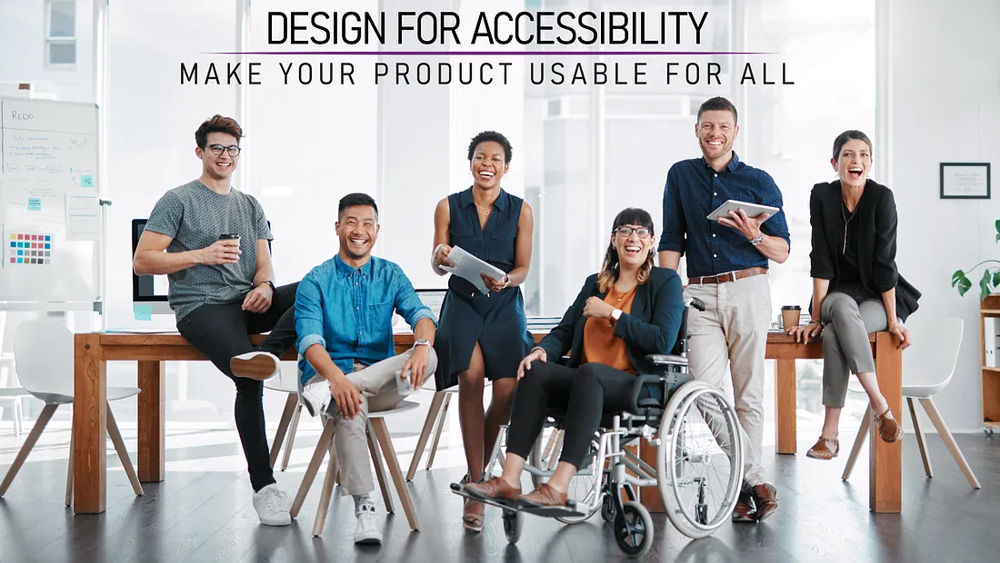
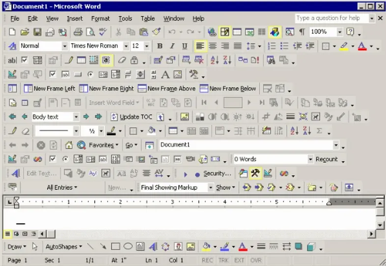

# “If you ask customers or product owners to choose between feature and accessibility, they will choose feature almost every time.”

There are several issues with this statement, yet it continues to resurface periodically. I’d like to take this opportunity to delve into it more thoroughly.

## Feature or accessibility is not a choice

When you present people with the dilemma of choosing between a feature and accessibility, you aren’t truly offering them a choice.

Accessibility of what? It can’t be the accessibility of the feature itself, as users must decide between the two.

Let’s assume we’re discussing the process of retrofitting an existing feature to make it accessible.

## Building for accessibility: Correct Approach

The sentence implies that making a feature accessible would require as much time and effort as adding an entirely new feature.

This might be true if accessibility is an afterthought. You’ll need to go back to the beginning and redo the design, the implementation, and the testing from scratch.

Consider a different perspective. If accessibility is considered from the outset — integrated into every step of the process — the additional effort can be minimal or even nonexistent for well-trained individuals.

## A Different angle

The problem lies not so much in the answer but in the question itself. Let’s replace “accessibility” with “usability” and observe the outcome:

> _If you ask customers or product owners to choose between feature and usability, they will choose feature almost every time._

Developing an app with this mindset often leads to a familiar scenario — one we’d rather avoid

<figure>
  
	<figcaption>
		Old version of Microsoft Word with toolbars that take up most of the screen making typing almost impossible and
		turning the search for a specific button into an adventure.
	</figcaption>
</figure>

We can all agree that investing extra effort to ensure a feature not only functions but is also usable is time well spent.

## Accessibility is usability: The 20% dilemma

Neglecting accessibility could mean that up to 20% of your users might encounter usability issues. These issues could render the entire feature partially or completely unusable for them.

Now, ask yourself: Is the feature still worth implementing if it fails to serve 1 in 5 users effectively?

## Beyond Extreme Cases

When advocating for accessibility, I often encounter a common misconception. Many people associate the term “accessibility” solely with specific disabilities, leading to responses like, “We don’t need that; we don’t have any blind users.” However, accessibility extends far beyond extreme cases.

Building with accessibility in mind, however, doesn’t mean focusing solely on screen readers. It’s about enhancing the robustness of a solution to accommodate diverse user needs, preferences, and environments.

- Larger, well-spaced buttons will help people with tremors or injuries like carpal tunnel syndrome but will also be easier to use on small mobile touch screens.
- A dark mode might be better suited to avoid eye strain at night, using the same app in direct sunlight might only be possible in light mode.

There are many examples like. By considering accessibility from the outset, we create products that benefit everyone, regardless of their abilities or their environment.

## Building an Accessible Solution: A Team Effort

It’s crucial to ensure that the entire team — not just developers — is well-versed in accessibility. By integrating accessibility into your entire process, you can create solutions that are inherently accessible. The best part? This approach requires minimal to no additional effort.

If you’re working on an existing project where accessibility wasn’t initially considered, don’t feel overwhelmed. Instead of trying to tackle every issue at once, take an incremental approach:

- **New Features**: Whenever you build a new feature, consider accessibility from the outset. Incorporate best practices to make it accessible.
- **Step-by-Step Improvements**: For existing code, focus on individual issues. With each update, address accessibility concerns. Gradually, your solution will become more accessible, benefiting a broader audience.

Remember: Every small improvement counts — making your product usable for more people is a worthy goal! 🌟

---

*I also wrote a German version of this post for [Global Accessibility Awareness Day (GAAD)](https://accessibility.day/) 2025 on fronta11y: [„Featuritis“: Neues Feature oder Barrierefreiheit?](https://www.fronta11y.org/featuritis-neues-feature-oder-barrierefreiheit/)*
