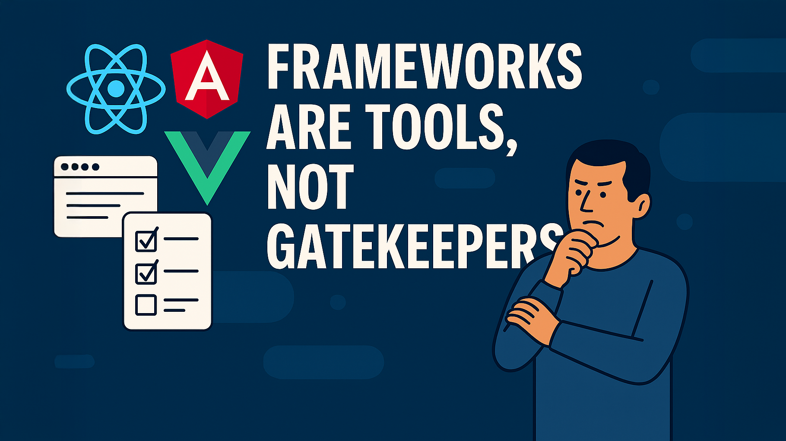

# Frameworks are tools, not gatekeepers: Rethinking web developer hiring

Another week, another missed opportunity. A seasoned web developer, 20+ years of experience, expert in Angular, certified in accessibility, and a proven leader, was dismissed from a job application. The reason? Not enough practical experience with React.
Not because the role demanded deep React internals or framework-specific wizardry. They were hiring someone to build features. And yet, the checkbox hiring mentality struck again.

## The checklist problem

Too many hiring processes are driven by rigid requirement lists, often crafted by people who don't truly understand how the web works. They treat frameworks like qualifications, not tools. And in doing so, they overlook developers who bring deep, transferable knowledge - people who understand the web's foundations and can adapt to any framework thrown their way.

This isn't just frustrating. It's wasteful.

## Hire for fundamentals, not familiarity

If I were hiring for a web development role, I'd choose someone who understands:

- Semantic HTML and why it matters
- How to build accessible, inclusive interfaces
- The principles of progressive enhancement
- How the browser actually works

These are the skills that transcend frameworks. React, Angular, Vue, Svelte - they're all just tools. A good developer can learn them. A great developer knows when to use them, and when not to.

So, when we have open opportunities and I'm hiring, this is exactly what I'm looking for. I'm not scanning for the latest buzzwords on a résumé or checking off a list of libraries someone has used. I'm searching for people who think deeply about the web, who understand its foundations, and who care about building resilient, user-first experiences. If you bring curiosity, clarity of thought, and a strong grasp of the fundamentals, you're already speaking my language.

## Frameworks fade, standards endure

Remember jQuery? It was revolutionary. It solved real problems. But most of what made it essential has now been absorbed into native web standards. The same fate awaits today's frameworks. In 10 years, React may be a footnote. Web standards, however, will still be here, evolving, expanding, and forming the bedrock of everything we build.

So why invest in developers who are deeply tied to a single framework, rather than those who build on enduring principles?

## Build for the future, not just the stack

Hiring someone who sees frameworks as tools instead of crutches means investing in solutions that can evolve. It means building products that aren't locked into a single ecosystem. It means fostering a team that can pivot, adapt, and innovate.

Framework fluency is useful. But framework dependency is dangerous.

Let's stop filtering out great developers because they haven't ticked the right box. Let's start hiring people who understand the web, not just the latest abstraction of it.
