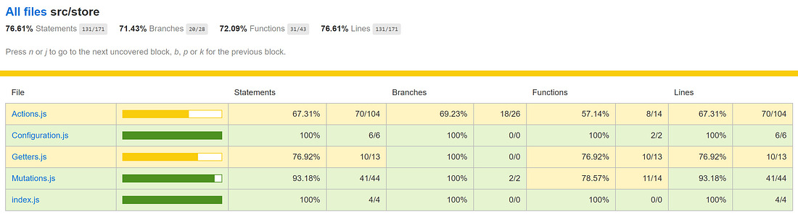
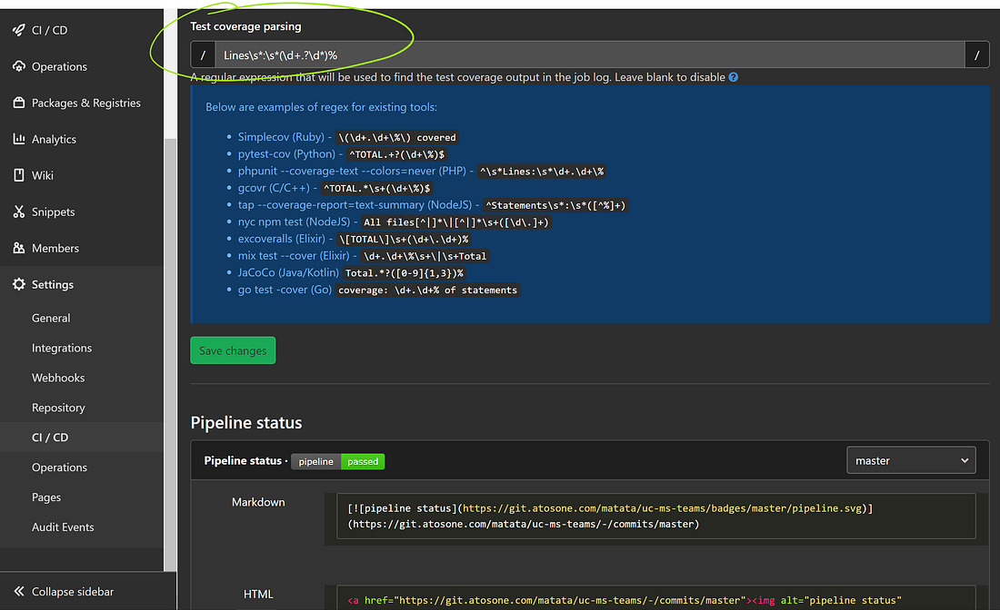

# How to display code coverage of a Vue project in Gitlab


One might think that this should be pretty straight forward and shouldn’t require an article, at least I did. But when I tried to set it up for some of my projects, it took me much more time than I expected.

There are some hoops you need to jump in order to get it to work. Each of which can be found somewhere on the internet, but getting them all together happened to be somewhat cumbersome. So I decided to write a quick how-to and get all the tricks together on a single page.

## The first pitfall

Since you’re probably already running unit tests, you should already have a script in your package.json that looks something like this:

```json
"scripts": {  
 "serve": "vue-cli-service serve",  
 "build": "vue-cli-service build",  
 "test:unit": "vue-cli-service test:unit",  
 "lint:js": "vue-cli-service lint",  
 "lint:css": "stylelint \\"src/\*\*/\*.scss\\""  
}
```

And here comes the first trick… Jest, the default runner in Vue.js projects, colors the console output to make it easier to read (most runners do). Unfortunately the coloring is not compatible with the Gitlab parser. So you’ll have to turn it off by adding the **— no-color** parameter.

```json
"scripts": {  
 "serve": "vue-cli-service serve",  
 "build": "vue-cli-service build",  
 "test:unit": "vue-cli-service test:unit **\--no-color**",  
 "lint:js": "vue-cli-service lint",  
 "lint:css": "stylelint \\"src/\*\*/\*.scss\\""  
}
```

## The jest config

The next step is to make jest collect coverage and generate a report that Gitlab will be able to parse. For that purpose you’ll have to edit the **jest.config.js** file.  
First activate coverage collection by setting **collectCoverage** to **true**, then add the **text-summary** type to the list of **coverageReporters**.

```js
module.exports = {  
 collectCoverage: **true**,  
 collectCoverageFrom: \['src/\*\*/\*.js', '!\*\*/node_modules/\*\*'\],  
 coverageDirectory: './coverage',  
 coverageReporters: \['html', 'text', '**text-summary**'\],  
 testMatch: \['\*\*/tests/\*.spec.js'\]  
};
```

This will generate the _coverage summary_ section in the console output that can then be parsed by the Gitlab job.

<figure>

<figcaption>The coverage summary section in the (colored) console reported with the text-summary parameter</figcaption>
</figure>

Additionally, the setting above will also generate an HTML report that is much more detailed and great to help you find the gaps in your coverage.

<figure>

<figcaption>The HTML report generated by jest</figcaption>
</figure>

## The CI script

The obvious step here, is to get your CI to run the test in order to have the coverage output generate within the Gitlab console. This is pretty simple since it just requires to call the unit test script from your package.json with npm.

```yaml
image: node

stages:

- test-unit

test-unit:  
 stage: test-unit  
 script: **npm run test:unit**  
 artifacts:  
 when: always  
 paths:

- coverage  
  expire_in: 30 days
```

> [!NOTE] 
> A nice to have you can add is to upload the coverage folder that contains the HTML report to the Gitlab artefacts. That way the detailed report will be available to everybody with the job.
> 
> In the example above, the HTML will always be uploaded regardless of the result of the stage(success or failure) and stored with the job for 30 days.

## Configuring Gitlab

The last step is to configure the Gitlab parser to properly pick our coverage from the console with a small regular expression. Unfortunately, Gitlab doesn’t support Jest by default and I couldn’t find one on the web that worked in all cases so I came up with my own:

```js
Lines\s*:\s*(\d+.?\d*)%
```

You just need to add the regex above in the _General pipelines_ area of your project’s _CI/CD Settings_.

<figure>

<figcaption>Regular expression used for test coverage parsing</figcaption>
</figure>

In my example, I chose to use the **Lines** coverage, but if you prefer to use **Statements** or **Functions** instead, you just need to replace the bold keyword in the regex.

### Wrapping up

That’s it… The next time your CI runs, you should see the coverage column in the Jobs list starting to fill up with your results

<figure>

<figcaption>Coverage under CI/CD > Jobs</figcaption>
</figure>

There is also a graphical history of your coverage available under _Analytics > Repository_

The only thing left to do now is improve the coverage 😉
