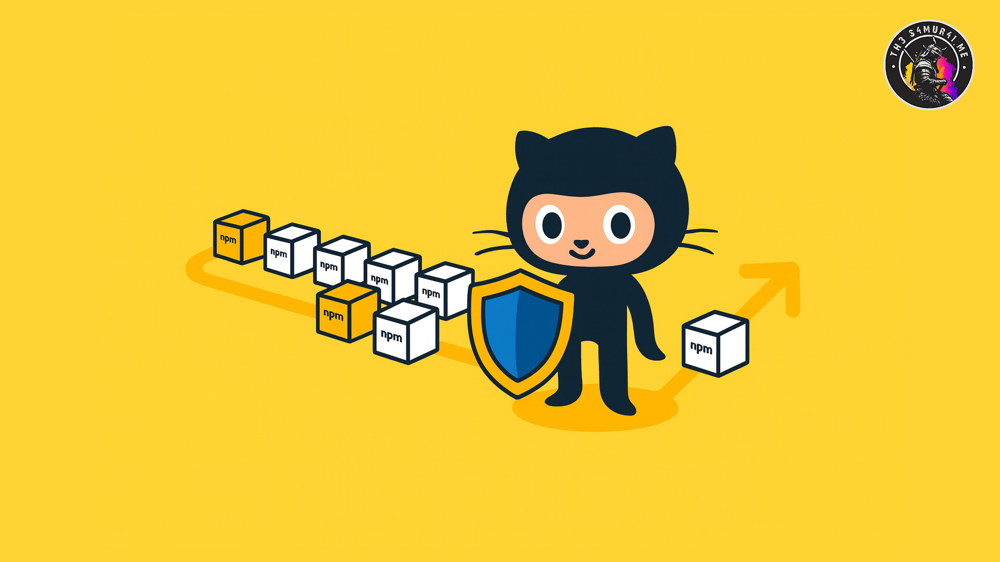
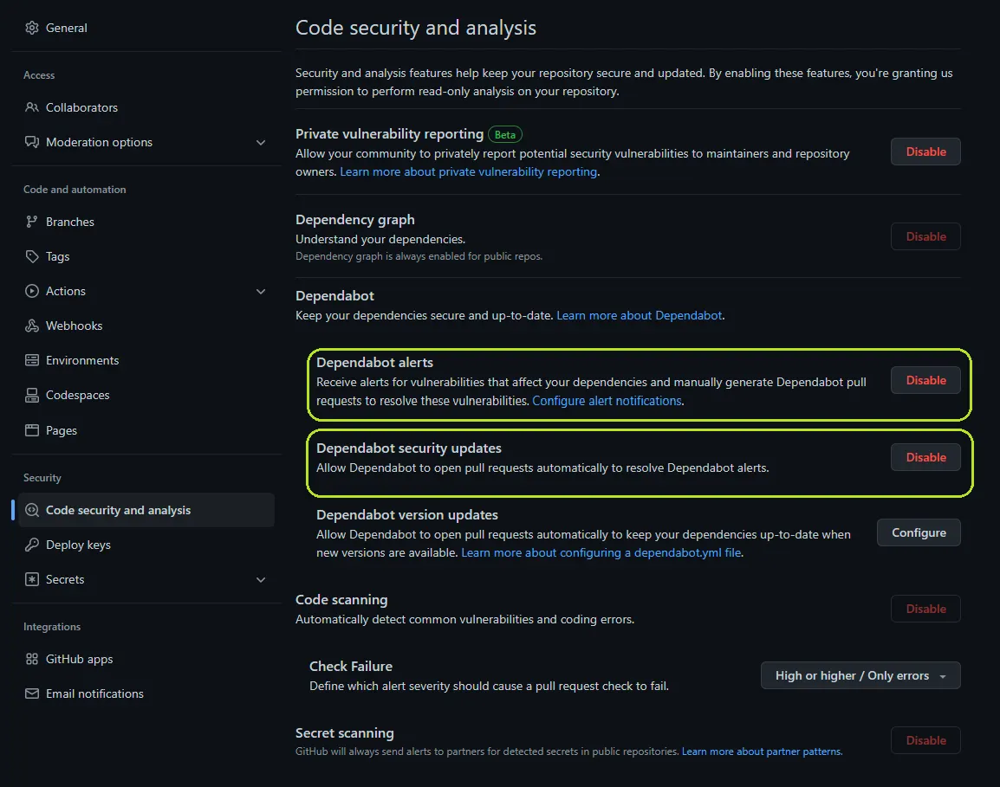

---
title:
  How to leverage GitHub and semantic release to reduce vulnerabilities in your
  packages
date: 2022-12-16T04:16:49.598Z
image: 'github-defending-against-NPM-vulnerabilities.jpg'
imageAlt: 'Github defending against NPM vulnerabilities'
published: true
description:
  Have you ever noticed, when you install your project’s dependencies, that npm
  is reporting known vulnerabilities you just installed?
tags:
  - GitHub
  - how-to
  - CI/CD
  - Vulnerabilities
  - DevSecOps
keywords:
  - GitHub Dependabot
  - semantic-release
  - automate security updates
  - reduce vulnerabilities
  - npm audit
  - DevSecOps best practices
  - continuous integration
  - package management security
---

import { Image } from 'astro:assets';

# How to leverage GitHub and semantic release to reduce vulnerabilities in your packages



You most probably know from personal experience that many projects nowadays require a bunch of dependencies to develop, compile or run.

Have you ever noticed though, when you install your project’s dependencies, that npm is also reporting known vulnerabilities in those dependencies?

<figure>

<figcaption>`npm install` reporting vulnerabilities</figcaption>
</figure>

Even if your project is only using a handful direct dependencies, chances are that those dependencies also have transitive dependencies on their own, and so on… You see where I’m going with this.

Let’s have a look at [the dependencies tree of the demo project](https://github.com/Th3S4mur41/demo-auto-security-release/network/dependencies)…

<figure>

<figcaption>List of dependencies and their vulnerabilities in both package.json and package-lock.json</figcaption>
</figure>

While the project itself “only” has eight (8) direct dependencies referenced in its [_package.json_](https://github.com/Th3S4mur41/demo-auto-security-release/blob/main/package.json), the whole dependencies tree contains a total of 533 packages.

Keeping track of all those dependencies and their vulnerabilities quickly becomes a tedious if not impossible task to handle manually.

This is where [GitHub](http://github.com) can help.

> [!NOTE]
> All following code snippets can be forked from [the demo repository on GitHub](https://github.com/Th3S4mur41/demo-auto-security-release).

## GitHub

Github recently published a list of [best practices to mitigate OWASP vulnerabilities](https://github.blog/2022-11-04-how-to-mitigate-owasp-vulnerabilities-while-staying-in-the-flow/).

<figure>

<figcaption>Explore how GitHub Advanced Security can help address several of the OWASP Top 10 vulnerabilities</figcaption>
</figure>

One of the tips is to leverage [Dependabot](https://github.blog/2022-05-25-how-we-use-dependabot-to-secure-github/) to alert developers about known vulnerabilities in dependencies and potentially update those dependencies to a patched version.

The first step is to activate Dependabot alerts and security updates. This can be done easily in the repository settings under _Code security and analysis_ as you can see in the screenshot below.

<figure>

<figcaption>Github’s “Code security and analysis” repository settings with Dependabot alerts & Dependabot security updates enabled</figcaption>
</figure>

### Dependabot alerts

The first setting will alert you when there are known vulnerabilities in dependencies you are using like running `npm audit` would, but it will also help you to track and manage those vulnerabilities.

<figure>

<figcaption>The dependabot alerts page showing a single moderate vulnerability</figcaption>
</figure>

### Dependabot security updates

The second setting will enable dependabot to try and fix the vulnerabilities automatically. If a fixed version of the dependency is available and compatible with your repository, Dependabot will open a pull request to update the affected package.

### Dependabot version updates

But why stop there? The third option, _Dependabot version updates_, will help you create a Dependabot configuration to automatically update all your dependencies as well.

The code below is the most basic Dependabot configuration to update your npm dependencies on a weekly basis and add a user or team as reviewer to all pull requests dependabot would create.

```yaml
# .github/dependabot.yml  
version: 2  
updates:  
 - package-ecosystem: "npm"  
 directory: "/" # Location of package manifests  
 schedule:  
 interval: "weekly"  
 reviewers:  
 - "<user or team name>"
```

Version updates can be further customized in many ways following the [official dependabot documentation](https://docs.github.com/en/code-security/dependabot/dependabot-version-updates/configuration-options-for-the-dependabot.yml-file).

### **Bonus:** Keep your CI up to date

While this is not directly related to your dependencies, it might help keep your CI secure too. By adding a few lines to your dependabot.yml, you can also configure it to also keep your Github Actions up to date. You just need to add a second package ecosystem with the following lines:

```yaml
- package-ecosystem: "github-actions"  
 directory: "/"  
 schedule:  
 interval: "daily"
```

The [demo repository’s dependabot config](https://github.com/Th3S4mur41/demo-auto-security-release/blob/main/.github/dependabot.yml) is set to update both npm packages and Github Actions on a daily basis.

### Auto merge Dependabot PR

In projects with a lot of dependencies, the amount of pull request generated by Dependabot can quickly become a burden to review and merge. If you have a test automation to validate your pull requests, this is something you no longer want to do manually.

> [!IMPORTANT]
> Before implementing this step, make sure to setup branch protection and a CI (build, test, deploy) you can trust since you will no longer be validating those changes manually.

<figure>

<figcaption>Make sure that PR need to be approved and your relevant CI workflows are successful before allowing pull requests to be merged</figcaption>
</figure>

Automatically merging Dependabot pull requests can be achieved by creating a workflow leveraging the Github API…

```yaml
# .github/workflows/dependabot-automation.yml
name: Depandabot automation
on: 
 pull_request_target:    
  types: [opened, synchronize, reopened]
permissions:
  pull-requests: write
  contents: write
jobs:
  dependabot-auto:
    name: '🤖 Dependabot Automation'
    runs-on: ubuntu-latest
    # Only run if PR was opened by dependabot
    if: ${{ github.actor == 'dependabot[bot]' }}
    steps:
      - name: Dependabot metadata
        id: metadata
        uses: dependabot/fetch-metadata@v1
          with:
            github-token: '${{ secrets.GITHUB_TOKEN }}'
      - name: Enable auto-merge for Dependabot PRs
        continue-on-error: true
        # Auto merge dependencies with patch or minor updates
        # Major versions still must be merged manually
        if: ${{(steps.metadata.outputs.update-type == 'version-update:semver-patch') || (steps.metadata.outputs.update-type == 'version-update:semver-minor')}}
        run: gh pr merge --auto --squash "$PR_URL"
        env:
          PR_URL: ${{github.event.pull_request.html_url}}
          # GH_TOKEN needed to trigger follow up worlflow: https://github.com/fastify/github-action-merge-dependabot/issues/134
          GITHUB_TOKEN: $
```

If your branches are configured to require approval before merging, you’ll also need to add the following step to the previous workflow to handle this as well.

```yaml
- name: Approve a PR
    continue-on-error: true
    run: gh pr review --approve "$PR_URL"
    env:
      PR_URL: ${{github.event.pull_request.html_url}}
      # GH_TOKEN needed to approve PR as code owner on protected branches
      GITHUB_TOKEN: ${{ secrets.GH_TOKEN || secrets.GITHUB_TOKEN }} 
```

Alternatively, you can also rely on Github Actions like [Dependabot Auto Merge](https://github.com/marketplace/actions/dependabot-auto-merge) to simplify the workflow similar to [the solution implemented in the demo](https://github.com/Th3S4mur41/demo-auto-security-release/blob/main/.github/workflows/on_dependabot.yml).

```yaml
# This is the workflow to automatically approve and merge dependabot PRs
#
name: Dependabot automation

on:
  pull_request_target:
    types: [opened, synchronize, reopened]

  # Allows you to run this workflow manually from the Actions tab
  workflow_dispatch:

jobs:
  dependabot:
    name: '🤖 Dependabot Automation'
    runs-on: ubuntu-latest
    if: ${{ github.actor == 'dependabot[bot]' }}

    steps:
      - uses: actions/checkout@v3
        with:
          ref: ${{ github.event.pull_request.head.sha }}

      - uses: ahmadnassri/action-dependabot-auto-merge@v2
        with:
          target: minor
          github-token: ${{ secrets.DEPENDABOT_TOKEN  }}
          command: squash and merge
```

### Avoiding introducing vulnerabilities with new dependencies

The Github team recently published a new action called [dependency-review-action](https://github.com/actions/dependency-review-action) that can further help reduce vulnerable dependencies by scanning pull request and blocking the addition of vulnerable dependencies before they can even make it in your code.

```yaml
name: Check Dependencies

on:
  pull_request:
    types: [opened, synchronize, reopened]

permissions:
  contents: read

jobs:
  dependency-review:
    name: '⛓️ Dependency Review'
    runs-on: ubuntu-latest

    steps:
      - name: '☁️ Checkout repository'
        uses: actions/checkout@v3

      - name: '🛡️ Dependency Review'
        uses: actions/dependency-review-action@v3
```

With all this in place, you have already reduced vulnerabilities in your code. But until you create a new release your package is still affected.

This is often a problem for legacy packages or packages that are not actively or regularly maintained. This is not something you want to happen to your package once you move on to your next project!

## semantic-release

[semantic-release](https://semantic-release.gitbook.io/semantic-release/) is a tool that helps you automate the release process of your package, including update the version number, generating release notes and changelog and publishing the package to a registry.

### Commit format

For semantic release to be able to determine which part of your semantic version to bump, your commits need to follow a commit convention.

In our example we use [commitlint](https://commitlint.js.org/#/) with an [extension of its default settings](https://github.com/Th3S4mur41/demo-auto-security-release/blob/main/commitlint.config.js) to make sure semantic release will be able to use them.

### Auto release security fixes

Your also need to configure semantic-release…

Additionally, to select which branch should trigger a release, you might also want to add a few plugins to generate release notes and a changelog, publish your package and generate a GitHub tag.

The following settings will also make sure that the generated changelog as well as the package config with the new version are committed to your repository.

```json
{
 "branches": ["main"],
 "plugins": [
  "@semantic-release/commit-analyzer",
  "@semantic-release/release-notes-generator",
  "@semantic-release/changelog",
  "@semantic-release/npm",
  [
   "@semantic-release/git",
   {
    "assets": ["CHANGELOG.md", "package.json", "package-lock.json"]
   }
  ],
  "@semantic-release/github"
 ]
}
```  

That’s it?

Not quite. The default commit message from dependabot won’t trigger a new release, so there is still something we need to do.

[Matt Rathbun](https://www.linkedin.com/in/matthewrathbun/) wrote a [straightforward guide](https://rathbun.dev/posts/semantic-release-dependabot/#approach-2---configure-semantic-release-to-understand-dependabot-commits) to update your semantic-release configuration to automatically trigger a new patch release for dependencies update.

The configuration consists of 2 changes:

- Update the commit analyzer to release a new patch for \`build(deps)\` commits
- Update the release notes generator to include the details about those commits in the GitHub release notes

```json
"release": 
  // ...
  "plugins": [
    [
      "@semantic-release/commit-analyzer",
      {
        "preset": "conventionalcommits",
        "releaseRules": [
          {
            "type": "build",
            "scope": "deps",
            "release": "patch"
          }
        ]
      }
    ],
    [
      "@semantic-release/release-notes-generator",
      {
        "preset": "conventionalcommits",
        "presetConfig": {
          "types": [
            {
              "type": "feat",
              "section": "Features"
            },
            {
              "type": "fix",
              "section": "Bug Fixes"
            },
            {
              "type": "build",
              "section": "Dependencies and Other Build Updates",
              "hidden": false
            }
          ]
        }
      }
    ]
    // ...
  ]
}
```

All that is left to do is to trigger semantic-release with every push on your main branch.

```yaml
name: 'Semantic release'

on:
  push:
    branches: [main]

jobs:
  # jobs to check your code come here

  release:
    name: '🏷️ Release'
    runs-on: ubuntu-latest

    environment:
      name: production
      url: https://github.com/${{ github.repository }}/releases/tag/v${{ steps.release.outputs.version }}

    outputs:
      version: ${{ steps.release.outputs.version }}

    steps:
      - name: '☁️ Checkout repository'
        uses: actions/checkout@v3
        with:
          fetch-depth: 0
          persist-credentials: false

      - name: '⚙️ Use Node.js'
        uses: actions/setup-node@v3
        with:
          check-latest: true
          cache: 'npm'

      - name: '⛓️ Install dependencies'
        run: npm ci --omit=optional --audit=false --prefer-offline --progress=false

      - name: '📦 Release'
        id: release
        env:
          GITHUB_TOKEN: ${{ secrets.GITHUB_TOKEN }}
          GH_TOKEN: ${{ secrets.GH_TOKEN || secrets.GITHUB_TOKEN }} # Needed to push to GitHub
        run: |
          npx semantic-release
          echo "::set-output name=version::$(npm run env | grep npm_package_version | cut -d '=' -f 2)"n::$(npm run env | grep npm_package_version | cut -d '=' -f 2)"
```

And your done… Now, every time Dependabot fixes a vulnerability in your dependencies, the CI will issue a new release of your package with a fix.

## Conclusion

By combining those two tools, you can reduce the risk of vulnerabilities in your packages without spending a minute of your time… I’d say, that is definitely worth spending the initial effort to do a little bit of configuration.

What do you think?
