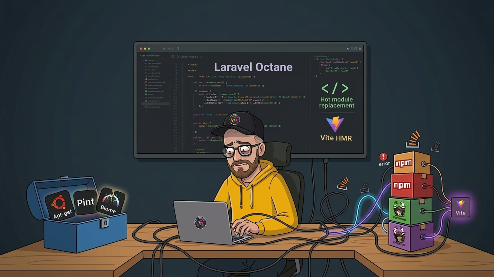

# PHP in 2026: Modern Language, Fragmented Tooling

I recently wrapped up a few projects where the team chose PHP and [Laravel](https://laravel.com/) as the foundation. In some cases, this stack powered both frontend and backend; in others, Laravel was used primarily as the backend/API layer, with frontends built in frameworks like [Astro](https://astro.build/) or [Vue.js](https://vuejs.org/). The decision was not purely technical, since other stack combinations could have supported the same architecture. The team's existing experience, along with the goal of helping trainees build hands-on experience across multiple tools, were both key reasons behind this choice. My role was primarily focused on the "plumbing"—setting up the tooling, the CI/CD pipelines, and the CSS architecture.

Coming from a heavy JavaScript/Node background, the experience was eye-opening. PHP has evolved into a powerhouse, but as I quickly discovered, its Developer Experience (DX) still feels like it's playing catch-up with the modern, unified ecosystems we see in the JS world.

## The Good: PHP isn't what it used to be

If you’re still thinking of PHP 7 or earlier, you’re looking at a different language. Modern PHP 8 has moved the ecosystem forward in major ways. We now have:

- **Union and Intersection Types:** Much stronger type modeling than old docblock-driven patterns.
- **Attributes:** Native metadata instead of framework-specific annotation parsing.
- **Constructor Property Promotion:** Less boilerplate in value objects and DTOs.
- **Named Arguments:** Clearer calls and fewer brittle parameter-order bugs.
- **Match Expressions and the Nullsafe Operator:** Cleaner control flow and safer object traversal.
- **Enums and Readonly Properties:** Better domain modeling with stronger immutability defaults.
- **Property Hooks and Asymmetric Visibility:** More expressive, less repetitive object APIs.

In terms of raw server-side performance, modern PHP with JIT (Just-In-Time) compilation holds its own. While it doesn't always match the raw concurrency of [Node.js](https://nodejs.org/) or the extreme "static-first" efficiency of Astro or [Eleventy](https://www.11ty.dev/), for a dynamic web app, PHP is no longer the bottleneck.

### Laravel as a Force Multiplier

Laravel adds a lot of modern ergonomics on top of PHP 8. In practice, that meant we could move quickly without giving up structure.

- **Hydration patterns are approachable:** tools like [Livewire](https://laravel-livewire.com/) and Inertia make it straightforward to add reactive UI behavior without going all-in on a full SPA architecture.
- **Database workflows are first-class:** migrations, seeders, and Eloquent made schema changes and data modeling much easier to manage across environments.
- **Delivery is pragmatic:** queues, jobs, validation, and auth scaffolding reduce a lot of repetitive application plumbing.

PHP/Laravel's server-side model also means it doesn't chase trends like SSR. Frameworks like React, Vue.js and Angular are now moving rendering and logic back to the server—a shift that feels like rediscovering what PHP has always done by default.

## The "DX" Reality Check

While the language is faster, the workflow feels fragmented. The biggest irony of modern PHP development is how much it relies on the environment it's often compared against.

To get a modern frontend experience (like Hot Module Replacement), Laravel now leans heavily on [Vite](https://vite.dev/). This means you aren't just using [Composer](https://getcomposer.org/); you're forced to maintain a Node/NPM environment side-by-side. You now have two distinct dependency trees to manage, update, and secure.

### OS Coupling Headache

One of my biggest frustrations during this setup was the tight coupling between PHP and the underlying OS.

In the Node world, [NVM](https://www.nvmnode.com/) allows you to swap versions seamlessly, mostly decoupled from your OS. With PHP, I ran into a "version ghost" problem:

- **Local Dev:** I used a [GitHub Codespace](https://github.com/features/codespaces) (Ubuntu-based) that had already moved to PHP 8.5.

- **CI/CD:** My Debian-based CI image was capped at PHP 8.4.

Because PHP relies on system-level package managers like `apt`, keeping your devcontainer and CI/production environment in sync is much harder than just dropping a `.node-version` file into a repo.

The OS coupling doesn't stop at version management. [Pail](https://laravel.com/docs/pail), Laravel's real-time log tailing tool, requires the `pcntl` extension, which simply doesn't exist on Windows. Windows developers either get no output at all, or have to add guards around every script that calls it. That's extra overhead that feels out of place in a modern DX, and it means Windows developers end up with a noticeably thinner toolset than their macOS or Linux colleagues.

We mostly avoided this by having everyone work on GitHub Codespaces, which gave the whole team a consistent Linux environment. But that's a privilege, not a given. Not every team has that option.

### Tooling Conflict: Pint vs. Biome vs. Prettier

Next, let’s talk about linting and formatting.
Laravel comes with Pint, which is a great wrapper around PHP-CS-Fixer. But coming from a Node.js tooling background, I’m used to formatters like [Prettier](https://prettier.io/) or [Biome](https://biomejs.dev/) that can handle many file formats and languages in one place. Pint is focused on PHP only. Biome even goes one step further by also offering linting across multiple languages. 

I tried to bridge the gap by using Prettier's PHP plugin for formatting while keeping Pint for linting. The result was a constant tug-of-war. The two tools often conflicted on rules, and I eventually had to drop the idea and settle for the standard PHP setup, even though it felt slower and less integrated in my VS Code workflow.

Given the mixed architecture above (Laravel plus Astro/Vue frontends), this became another reason we had to rely on both Composer and NPM to install and run dev tools.

### Registry Gap: Private Packages and the Composer Workaround

One challenge that caught us off guard was distributing a small internal package we built to handle corporate SSO across multiple applications. In the npm world, you'd publish to GitHub Packages (or a private registry) and install it with a scoped name. Maven, Docker, and NuGet all have their own first-class registry story on GitHub too.

Composer doesn't. There is no GitHub Packages registry for PHP. So if you want to share a private Composer package via GitHub, your options boil down to using the repository's Git URL directly in `composer.json`. Composer will then clone the repo over SSH to resolve and install the package.

That creates a cascade of problems:

- **Authentication:** SSH cloning doesn't work with a standard `GITHUB_TOKEN`. You need a Personal Access Token with the right scopes, or—as we did—a dedicated deploy key per repository.
- **Firewall friction:** Our company blocks outbound SSH to the internet by default. The moment CI tried to clone via SSH on our self-hosted runners, it hit a wall. Every pipeline that pulled the private package was dead in the water until we negotiated a firewall exception. A non-trivial conversation in a corporate context.

Contrast this with npm, where `npm install` over HTTPS with a scoped token just works out of the box in most corporate networks. The Composer approach feels like a workaround bolted onto infrastructure that was never designed for this use case.

[Packagist](https://packagist.org/) is the canonical solution, but it's public-only. [Private Packagist](https://packagist.com/) is the paid answer and works well, but it's yet another service to procure and manage. It's a gap that the ecosystem has quietly accepted, even as every other major package ecosystem has solved it natively.

## Is the Modernization Worth the Friction?

PHP has done the hard work of fixing the language. It is fast, type-safe, and expressive. But the infrastructure, the way we install it, the way we sync environments, and the way we tool it, still feels like it belongs to a different era of web development.

None of the issues we hit were true blockers. We shipped. But each one demanded extra effort, custom scripts, and environment-specific workarounds that increased project complexity in ways that feel unnecessary when compared with ecosystems where these concerns are solved natively.

## What Is Your Experience?

I approached this from a JavaScript/Node-heavy background, not as a long-time PHP specialist. So there is a good chance I missed patterns, tools, or ecosystem conventions that more experienced PHP teams use to smooth out these rough edges.

I'd really value your feedback, especially on two questions:

1. What has made the biggest difference for your team in improving PHP/Laravel DX day-to-day (tooling, environment strategy, CI setup, team conventions, or anything else)?
2. How are you handling the specific friction points above in practice: OS coupling, formatter/linter conflicts, and private package distribution in corporate environments?

If you've found reliable approaches, I'd love to learn from them and update our workflows accordingly.
