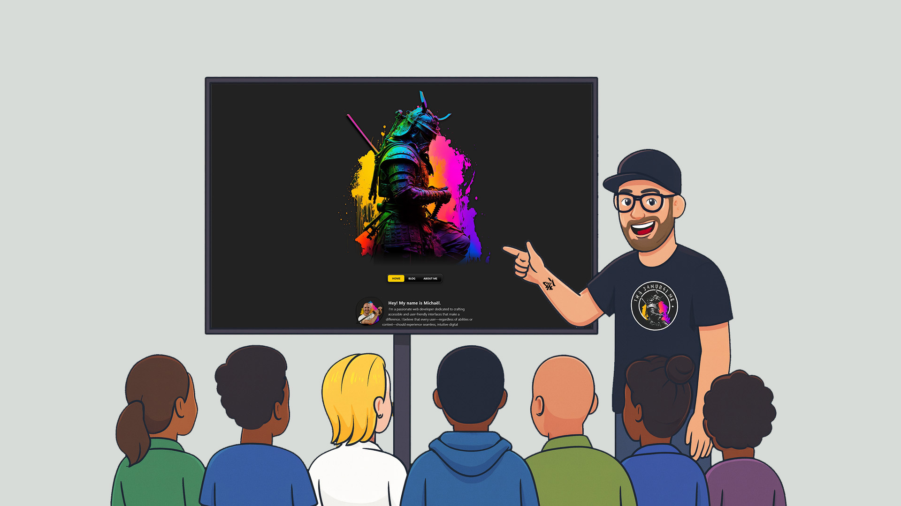

# Rebuilding My Website: From Link Hub to Living Playground

For the longest time, my website was little more than a nicely styled list of links to my social accounts. It looked clean, it did its job, and honestly… I didn't feel the need to push it further. Having published some articles on [Medium](https://th3s4mur41.medium.com/) and [LinkedIn](https://www.linkedin.com/in/michaelvanderheyden/), as I've started writing more, I wanted a place to publish my thoughts that was truly mine. A real home. A blog I could shape, control, style, and transform as I see fit.

And because I love building things and experimenting with whatever new web tech catches my eye, I didn't want to rely on a ready‑made solution. No WordPress, no pre‑packaged static site generator, no "just deploy this template." Those would have been easier, faster, and probably more feature‑rich out of the box. But they wouldn't give me what I was looking for: complete control over accessibility, the ability to experiment with the newest CSS features, and a codebase I could mold to my exact needs.

So I rebuilt everything from scratch.

## A platform I can grow with

### Simple writing, powerful output

The beauty of this setup is how it balances simplicity with power. I write my posts in Markdown, which lets me focus on the content without getting bogged down in HTML semantics. The writing experience stays straightforward and enjoyable.

Behind the scenes, [Astro](https://astro.build) transforms this Markdown into clean, accessible, semantic HTML that I can then style as I see fit. But it doesn't stop there, I can enhance the output using both third‑party and custom remark and rehype plugins to extend functionality, improve accessibility, and add features that matter to me. And when I need that extra bit of control for power‑user stuff? I can still embed HTML directly in my Markdown.

### Extensible and flexible

This gives me full control over structure, performance, and UX, without sacrificing the lightweight authoring experience I wanted. And honestly? I'm really happy I chose this path. The site is still young, but it already feels like a space I can grow into.

## A playground for modern CSS

One of the biggest joys of rolling my own setup is the freedom to experiment with cutting‑edge CSS features. Here are some of the techniques I'm currently using:

- **[Anchor positioning](https://developer.mozilla.org/en-US/docs/Web/CSS/Guides/Anchor_positioning)** creates smooth transition effects in the navigation, letting elements respond dynamically to their anchors
- **[View transitions](https://developer.mozilla.org/en-US/docs/Web/CSS/Guides/View_transitions)** add that satisfying little kick when you navigate between pages, making the experience feel more polished and cohesive
- **[Scroll‑driven animations](https://developer.mozilla.org/en-US/docs/Web/CSS/Guides/Scroll-driven_animations)** smoothly fade images in and out as they enter or leave the viewport, creating a more dynamic reading experience
- **[Scroll‑triggered animations](https://developer.chrome.com/blog/scroll-triggered-animations)** let list items slide gracefully into view as you scroll, adding subtle movement without overwhelming the content

And that's just scratching the surface. If you're a CSS enthusiast, I encourage you to explore the site and discover the more subtle transitions and animations I've tucked away. Look for the little details: the way elements respond to hover, how colors shift, the micro‑interactions that make the interface feel alive.

### Progressive enhancement

All of this is built as progressive enhancement, ensuring the experience never breaks if your browser doesn't support a particular feature. And importantly, user preferences are always respected—if you've set your system to prefer reduced motion, the animations will step aside gracefully.

## A journey, not a finished product

This rebuild is just the beginning. I have a backlog full of ideas I'm excited to explore:

- A light mode for those who prefer brighter interfaces
- Search and filtering capabilities for the blog
- More experimental CSS features as they become available
- Continued accessibility refinements
- And whatever else I dream up along the way

I'm building this in the open, and I'd love your help making it better. If you notice any issues or encounter accessibility barriers, please [open an issue on GitHub](https://github.com/Th3S4mur41/th3s4mur41.me/issues). And if you like where this is going, feel free to share your thoughts on [Bluesky](https://bsky.app/profile/th3s4mur41.me) or [Mastodon](https://fed.brid.gy/bsky/th3s4mur41.me).

Thanks for stopping by and happy exploring!
