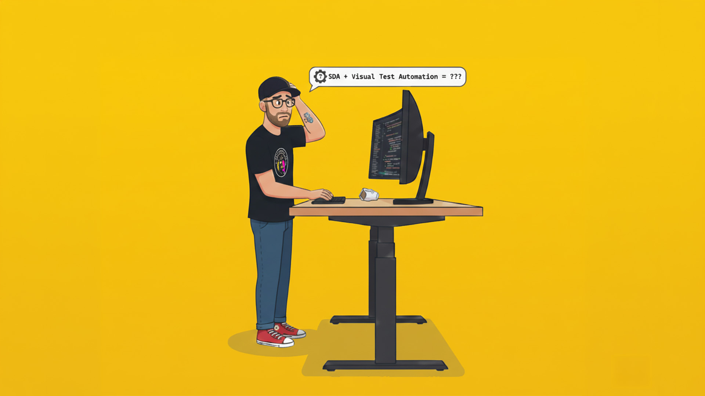
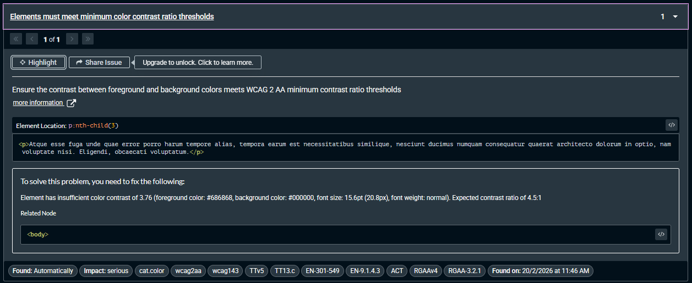

import CodePen from '/src/components/CodePen.astro';

# Scroll-Driven Animations and Test Automation



For years, web developers and QA engineers have played a game of cat and mouse with the browser. We've spent years optimizing test automation to handle the asynchronous nature of the web, reaching a "well-oiled" state of stability. Now, a new challenger has entered the ring: [Scroll-Driven Animations (SDA)](https://developer.mozilla.org/en-US/docs/Web/CSS/Guides/Scroll-driven_animations).

## The Era of "Wait and See"

Traditionally, test automation tools (like [Playwright](https://playwright.dev/), [Cypress](https://www.cypress.io/), or [Selenium](https://www.selenium.dev/)) have become incredibly smart at waiting. They don’t just "sleep", they check for:

- Page Load States: Ensuring the network is idle.
- Element Visibility: Checking if a button is not just in the DOM, but clickable.
- Animation Stabilization: Waiting for a brief period so a 300ms fade-in doesn't cause a "flaky" screenshot.

In this world, animations were transient. They had a beginning, a middle, and an end. If you waited half a second, the UI would reach its "final form," making it safe to test.

The same is true for automated accessibility tests, which usually wait for the page to be in a stable state to accurately assess contrast ratios, focus states, and other accessibility features.

## Enter the Scroll: Why SDA Changes the Game

<baseline-status featureId="scroll-driven-animations" client:only="js"></baseline-status>

Scroll-driven animations break the "final form" rule. Unlike classic CSS transitions that trigger and finish, an SDA’s state is bound directly to the scroll progress.

The problem? There is no longer a "finished" state to wait for. The element is effectively always in the middle of a transition as long as the user (or the test runner) is moving.

### The Visual Testing Trap

If you are performing visual regression testing or worse accessibility testing, SDA creates a high risk of "flakiness." Depending on the exact pixel-position of the scroll container when the screenshot is snapped, an element might be 20% opaque or 80% opaque.

<figure>

<figcaption>The final paragraph is partially transparent due to a fade‑in animation triggered on scroll, which causes accessibility tools to flag a contrast issue even though the text becomes fully opaque once fully in view.</figcaption>
</figure>

Here's this in action (if your browser supports it):
<CodePen
	title="Fade-in on scroll: A visual testing nightmare"
	href="https://codepen.io/th3s4mur41/pen/WbxdRZO"
	height={500}
	description="Interactive CodePen demo showing a scroll-driven animation where text fades in as the user scrolls, illustrating the challenges it poses for visual regression testing."
/>

Notice how the text opacity changes as you scroll—this inconsistent state is exactly what breaks automated testing.

For automated accessibility tests, this is a nightmare. If a test runner checks the text while it's mid-fade, the "baseline" image will never consistently match the "current" image.

### Accessibility Testing

The friction isn't just visual; it's functional. Automated accessibility tools like [axe-core](https://www.deque.com/axe/axe-core/) are designed to catch contrast violations.

If your test scrolls to a section to check for compliance, and that section uses an SDA to fade text in, the tool might catch the text while it's at 30% opacity.

> [!IMPORTANT]
> **The Result:** Your accessibility audit will report "False Positive" contrast violations even though the final rendered state meets WCAG requirements.

<figure>

<figcaption>During the scroll‑triggered fade‑in, the text renders with reduced opacity, causing Axe DevTools to flag a temporary [contrast violation](https://dequeuniversity.com/rules/axe/4.11/color-contrast) even though the final state meets [WCAG requirements](https://www.w3.org/WAI/WCAG22/quickref/).</figcaption>
</figure>

> [!NOTE]
> **The Irony:** The site might be perfectly accessible once the user finishes scrolling, but the automation tool lacks the "context" of the scroll-linked state.

## Scroll-Triggered vs. Scroll-Driven

[Scroll-triggered animations](https://developer.chrome.com/blog/scroll-triggered-animations) represent the next evolution of scroll-based animations arriving in 2026.
It's important to distinguish between the two, as they require different testing strategies:

| Feature | Behavior | Testing Impact |
|---------|----------|----------------|
| Scroll-Triggered | Scrolling past a point starts a standard animation. | **Lower Friction**. Treat it like a regular animation; just add a "wait" after the scroll event. |
| Scroll-Driven | Animation state is directly tied to scroll progress | **High Friction**. There is no "end" state. You must programmatically force a specific scroll percentage to get a consistent state. |

Considering the differences, scroll-triggered animations pose less of a problem for test automation, as they can be handled with traditional waiting strategies. Scroll-driven animations, however, require a more nuanced approach to ensure reliable testing outcomes.

## How do we adapt? (It’s complicated)

There is no "magic button" in current automation frameworks to handle SDA globally. Because these animations are tied to the scroll timeline rather than a clock, our usual tricks for "waiting" fall short. Here is a breakdown of current strategies and why they aren't perfect:

### Forcing `prefers-reduced-motion`

<baseline-status featureId="prefers-reduced-motion" client:only="js"></baseline-status>

Setting [`prefers-reduced-motion`](https://developer.mozilla.org/en-US/docs/Web/CSS/@media/prefers-reduced-motion) is the standard "go-to" for automation. By setting the browser's emulation to `reduced`, many CSS animations are stripped away.

> [!WARNING]
> **The Flaw:** SDA is often used for simple opacity fades (like the CodePen example). Technically, a fade isn't "motion," so many developers don't wrap these in a media query. If the animation isn't wrapped in `@media (prefers-reduced-motion: no-preference)`, the test will still catch the text in a semi-transparent state.
>
> From a user perspective, an opacity fade should probably not be wrapped in `@media (prefers-reduced-motion: no-preference)`. Doing so purely to pass test automation would compromise the experience for users who've enabled `prefers-reduced-motion` for medical reasons (e.g., vestibular disorders).

### The Future: `prefers-reduced-transparency` as a Better Solution

Ideally for those fading use cases, we'd use [`prefers-reduced-transparency`](https://developer.mozilla.org/en-US/docs/Web/CSS/@media/prefers-reduced-transparency), but browser support isn't mature enough to make this a reliable universal fix yet, nor is it possible to set this setting in most testing tools yet.

<baseline-status featureId="prefers-reduced-transparency" client:only="js"></baseline-status>

### Manual Scroll Mocking (E2E Only)

For functional E2E tests, you can force the browser to a specific pixel value:

```js
// Force Playwright to scroll to specific position before taking screenshot
// (Note: This is rarely precise enough for reliable testing)
await page.evaluate(() => window.scrollTo(0, 500));
```

> [!WARNING]
> **The Flaw:** This works for a specific visual regression check of a single component, but it's a nightmare for accessibility (a11y) audits. Tools like axe-core usually scan the entire page. You can't easily "scroll-and-scan" every 10 pixels to ensure every element is at 100% opacity when the scanner hits it. It's simply too much overhead.

### Linearizing or Disabling Timelines (The Technical Hack)

The third option involves using a "test-only" stylesheet or attribute injection to override the scroll-timeline. 
This would essentially turn off problematic animations during test automation.

#### The How

You could inject CSS that overwrites the [animation-timeline](https://developer.mozilla.org/en-US/docs/Web/CSS/animation-timeline) by setting `animation-timeline: none !important;`, forcing the element to its final state (e.g., `opacity: 1`).

Alternatively, you could set a `data-a11y-testing` attribute on the body and use that as a selector to disable animations in your stylesheet:

```css
body:not([data-a11y-testing]) .animated-element {
	animation: fadeIn 1ms linear both;
	animation-timeline: view();
}
```

> [!WARNING]
> **The Flaw:** This isn't "testing the site"—it's testing a modified version. If your CSS override accidentally masks a bug that only exists during animation, your test loses validity.
>
> Additionally, depending on your test strategy, this may not be possible. For example, running an a11y audit with axe-core doesn't allow custom CSS injection, especially when auditing production websites.

### The Missing Feature: A "Global SDA Toggle"

The ideal solution doesn't actually exist yet. We need a native browser setting or a flag in the [Chrome DevTools Protocol](https://chromedevtools.github.io/devtools-protocol/) (CDP) that allows automation runners to "freeze" or "disable" scroll-linked timelines, forcing all elements to their 100% animation state.

Until then, we're stuck choosing between flaky visual tests or heavy-handed CSS overrides that might mask real-world issues.

## What's Your Experience?

As SDA becomes more prevalent, this friction is only going to increase. I’m curious if anyone has found a more elegant way to handle this without compromising the integrity of the test environment.

- Are you using specific Playwright/Cypress configurations to handle this?

- Have you found a way to bridge the gap for a11y scanners like axe-core?

**Let’s talk about it!** Reach out to me on Bluesky or LinkedIn if you have a working solution or a horror story to share.
