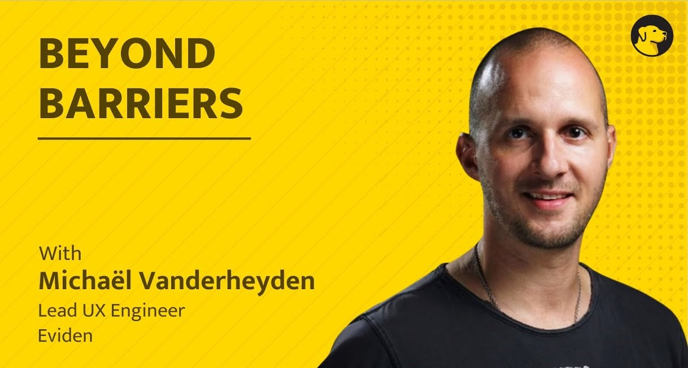

# Scaling Accessibility, Developer Mindsets & the European Accessibility Act

I had the pleasure to join Brian Gavin, Co-Founder of [WallyAX](https://wallyax.com) for an episode of the [Beyond Barriers Podcast](https://wallyax.com/beyond-barriers) – Season 6

In this episode, we uncover:

1. Michaël’s 20-year journey from early WCAG 1 projects to leading global accessibility efforts
2. Why accessibility and usability are inseparable in modern development
3. How to shift from retrofitting accessibility to building it in from the start
4. The social and technical challenges of scaling accessibility across diverse teams
5. The growing impact of the EU Accessibility Act and what it means for developers
6. How small, consistent improvements can create lasting cultural change
7. The future of accessibility through better tools, collaboration, and AI
   Tune in for a thoughtful, real-world conversation about building accessibility into the process, not just the product.

Now streaming on your favorite podcast platform!

- [Spotify](https://open.spotify.com/episode/29oPQn4SdSh4WpGIfGDul9)
- [Apple Music](https://podcasts.apple.com/in/podcast/scaling-accessibility-developer-mindsets-the-european/id1732255045?i=1000729115262)
- [YouTube](https://www.youtube.com/watch?v=h9I7w4nDvk4)
- [Amazon Music](https://music.amazon.com/podcasts/17d6e81e-6da7-4eb8-ac7d-caf00326733a/episodes/acb75ef7-6226-4228-b30c-a6673e023a3f/scaling-accessibility-developer-mindsets-the-european-accessibility-act-micha%C3%ABl-lead-ux-engineer)
